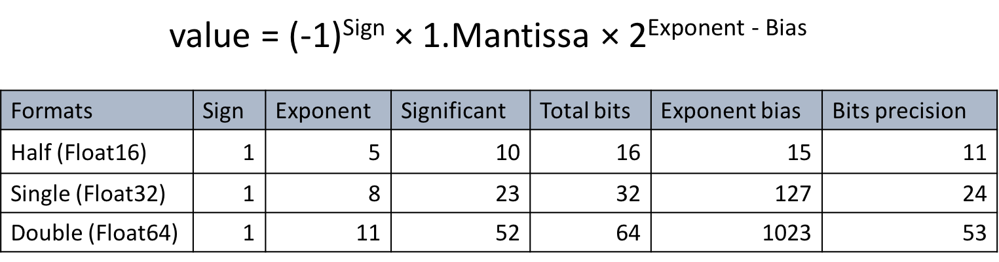
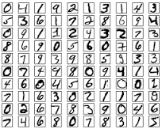
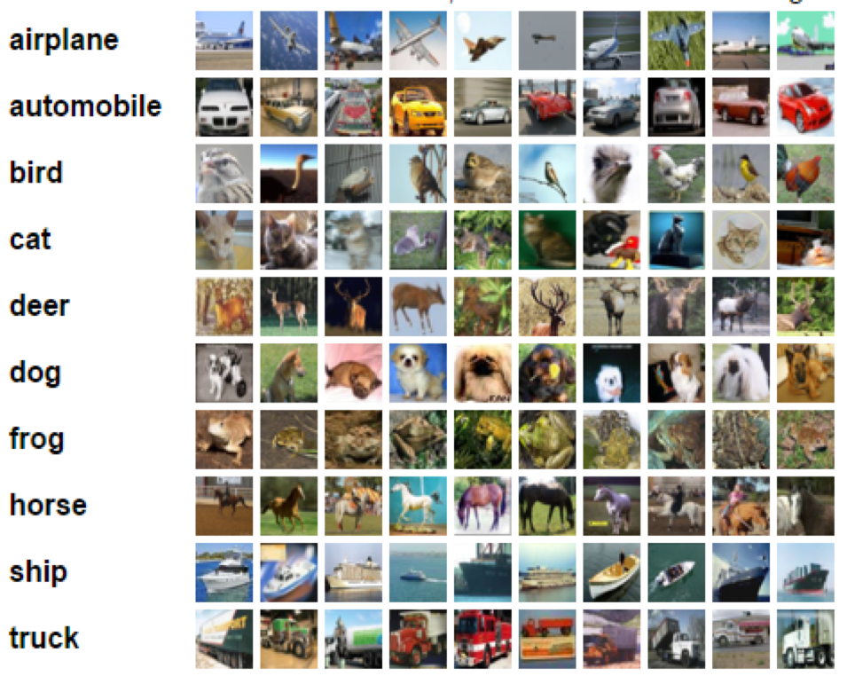
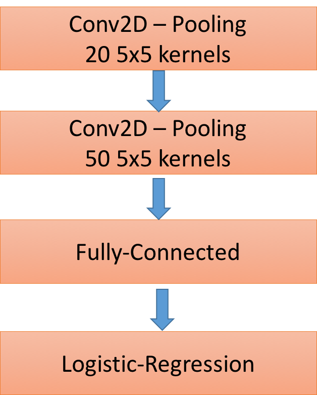
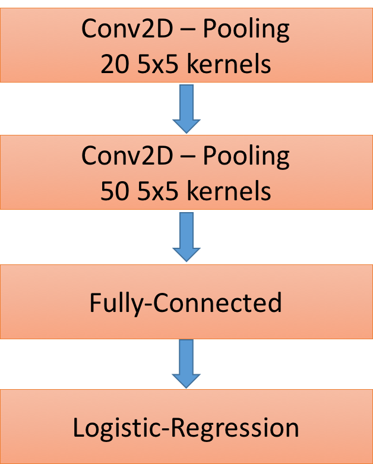
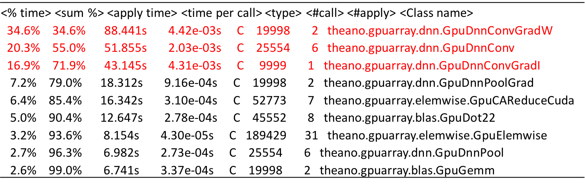

### Final Project Report
# Training Convolutional Neural Network using different floating point formats
  * Tuan Nguyen
  * Deep Learning Spring 2017
  * Dr. Martin Hagan
  
## 1. Introduction

In recent years, Deep Learning or Deep Neural Network (DNN) has grown tremendously in its popularity and usefulness [1]. However, DNN is computationally intensive, power-hungry and very often limited by hardware capability. For many years, single-precision (float32) and double-precision (float64) floating point formats have been widely used as the default formats for DNN. 

However, using lower precision is growing rapidly as a trend in DNN research. Recent research [2] shows that low-precision and very low precision are sufficient for training and running DNN. In addition, in 2016, NVIDIA introduced Pascal GPU architecture and CUDA 8 SDK that fully support half-precision (float16) floating point format and mixed-precision computing [3]. The lower memory, higher speed, and less power consumption are main motivations behind this trending. 

This project is a small research to examine how different floating-point precisions affect on DNN's accuracy, speed and memory. Due to the limited time, a simplified version of Convolutional Neural Network based on LeNet5[] has been selected as the network to train. The selected datasets are MNIST [4] and CIFAR-10 [5], which are well-known benmarking datasets for machine learning algorithms.

The rest of report is oraganized as following: Section 2 is a very short introduction to Floating Point Formats used in this research. Section 3 is a description about MNIST and CIFAR-10 datasets and Section 4 describes about Convolutional Neural Network design. Section 5 shortly describes about the hardware/software configuration in the experiment and results will be shown in Section 6. The final section is a short conclusion.
## 2. Floating Point Formats
### 2.1 IEEE 754 Floating Point Formats

In this project, three IEEE 754-2008 [6] floating point formats are used in training DNN: half-precision (float16), single-precision (float32), and double-precision (float64) floating point formats. Basically, a floating point format includes three components: sign, exponent and significant/mantissa. The bit-width for each component in each format as well as the formula to compute the value is shown in above figure.

In comparison with fixed-point numbers, the floating point numbers have a much wider range (due to exponent component). As a result, floating point numbers are suitable for scientific computation and a wide range of applications. For many years, float32 and float64 have been widely used as the default formats for DNN. Recently, float16 is emerging as another option for DNN. Compared to float32 and float64, float16 has much shorter bitwidth and therefore, it is able to offer a significant speed-up and power savings.

### 2.2 An experiment on a combined IEEE compliant float16-float32 hardware

Inspired by the trending in using low-precision and mixed-precision computation, we designed a novel combined IEEE compliant float16 and float32 multipliers for DNN [7]. Our design is basically an IEEE-754 2008 compliant float32 with additional logic to perform IEEE-compliant float16 multiplications. The combined multipliers can be easily configured to run in float16 mode for power saving or in the float32 mode for accuracy or compatibility. 

The proposed multipliers is implemented in RTL-compliant Verilog and then synthesized in an ARM 32 nm CMOS library in IBM/GF cmos32soi technology. The average power estimation was achieved by running the simulation on 50,000 random test vectors generated by TestFloat-3b[].  As shown in the Table, switching to float16 mode can save 44% power compared to float32 mode.

This research triggered my curiosity about using low-precision numbers in DNN and led to this project. A huge savings in power and computation can be archieved if float16 (or even lower formats such as 8 bits integer (INT8)) can be safely used in DNN.

## 3. Datasets

### 3.1 MNIST Dataset

The MNIST dataset [4] consists of handwritten digit images and it is divided in 60,000 examples for the training set and 10,000 examples for testing. In many papers as well as in this tutorial, the official training set of 60,000 is divided into an actual training set of 50,000 examples and 10,000 validation examples (for selecting hyper-parameters like learning rate and size of the model). All digit images have been size-normalized and centered in a fixed size image of 28 x 28 pixels. 

Here are some examples of MNIST digits:

	

### 3.2 CIFAR-10 Dataset
The CIFAR-10 dataset [5] consists of 60000 32x32 color images in 10 classes, with 6000 images per class. There are 50000 training images and 10000 test images. 

The dataset is divided into five training batches and one test batch, each with 10000 images. The test batch contains exactly 1000 randomly-selected images from each class. The training batches contain the remaining images in random order, but some training batches may contain more images from one class than another. Between them, the training batches contain exactly 5000 images from each class. 

Here are the classes in the dataset, as well as 10 random images from each:

			

The classes are completely mutually exclusive. There is no overlap between automobiles and trucks. "Automobile" includes sedans, SUVs, things of that sort. "Truck" includes only big trucks. Neither includes pickup trucks.

## 4. Convolutional Neural Network

## 5. Experimental Setup
### 5.1 Convolutional Neural Network for MNIST

### 5.2 Convolutional Neural Network for CIFAR-10

### 5.3 Hardwares/Softwares
 * Hardwares: The experiment has been done on a PC with Intel(R) Core (TM) i7-4790 @ 3.6 GHz (Quad) coupled with GPU Nvidia GeForce GTX Titan Black 6GB.
 * Softwares: the CNN program has been written in Python based on Theano 9.0 library. Two additional libraries were also installed to support for float16: libgpuarray and pygpu. To do computation/memory profiler, psutil and iPython were also installed.

## 6. Experimental Results
### 6.1 Accuracy
The validation score and test score in each format, computed by percent of error rate, for both MNIST and CIFAR  has been shown in the Table below.

	

As shown, float16 has little to no impact on accuracy of DNN. In some cases, the float16's accuracy is even higher than the float32 and float64 formats (however, the difference is too small to be considered an improvement). Besides, we can see that float64, the highest precision, does not offer the better accuracy in compared with two lower precision formats. The experiment also shows that CIFAR 10 needs deeper network to gain more accuracy. 

### 6.2 Peak Memory
The peak memory in KB has been reported sing memory profiler and shown in below Table.

	

From the Table, GPU peak memory is much higher than CPU peak memory. In addition, in GPU, the peak memory of float16 is exactly a half of float32 and one fourth of float64, which match with the bidth-width ratio between them. 

### 6.3 Speed
Below Tablle shows the total running time of training and runing network. Besides,a profiler was used to monitor the percent of CPU time, GPU time and Transfer time in total time.

	

As shown in Table, the GPU Time is much higher than CPU, which indicates that in DNN, GPU does most of the dirty work. We also see that float64 is 3 to 4 times slower compared to float32. 

However, float16 is expected to be faster than float32 but in Table, we see that float16 is a little bit slower than float32. The reason for that is shown in the logging message below:

	

While doing convoltion, even the input data type is float16, the Theano back-end convolution still applies float32 precision to compute the numbers. As a result, a 2 direction conversion has been used to convert float16 inputs to float32 inputs before doing convolution and another conversion has been used to convert float32 results to float16 results. This is because Theano has still not fully supported float16 computation in convotion operations (conv2d).

Another profiler was used to measure the frequency of convolution operations in DNN and the results shown in below Table.
	

The top three operations are all convolutions and account for 80% computation of CNN. This number agrees with a research from MIT which showed that 90% computation of CNN is due to convolution operations.

## 7. Conclusion

## Reference

[1]: Goodfellow, Ian, Yoshua Bengio, and Aaron Courville. Deep learning. MIT Press, 2016.

[2]: Courbariaux, Matthieu, Yoshua Bengio, and Jean-Pierre David. "Training deep neural networks with low precision multiplications." arXiv preprint arXiv:1412.7024 (2014).

[3]: https://devblogs.nvidia.com/parallelforall/mixed-precision-programming-cuda-8/

[4]: http://yann.lecun.com/exdb/mnist/

[5]: https://www.cs.toronto.edu/~kriz/cifar.html

[6]: https://standards.ieee.org/findstds/standard/754-2008.html

[7]: Tuan Nguyen, James E. Stine. "A combined IEEE 754 compliant half-precision and single-precision floating point multipliers for Deep Learning." Asilomar 2017 (Submitted).

