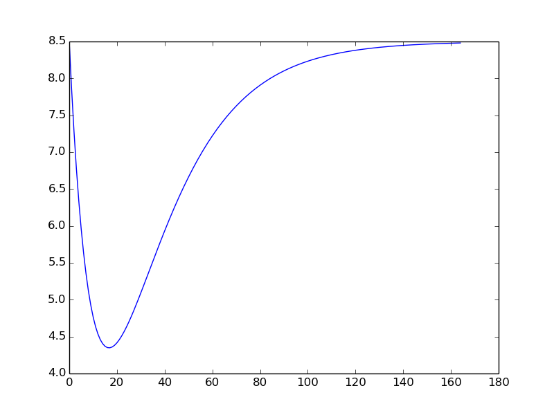
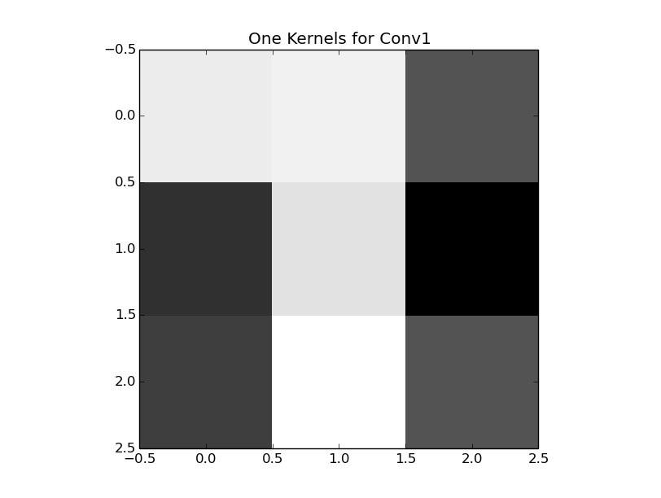
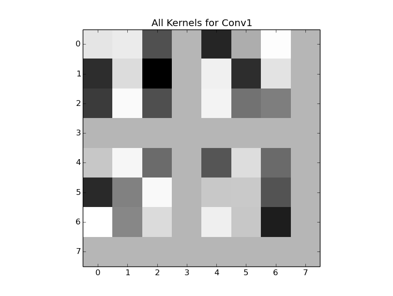
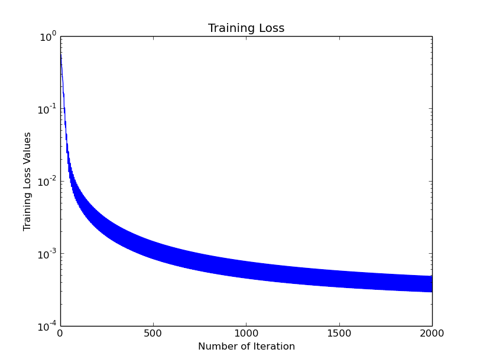
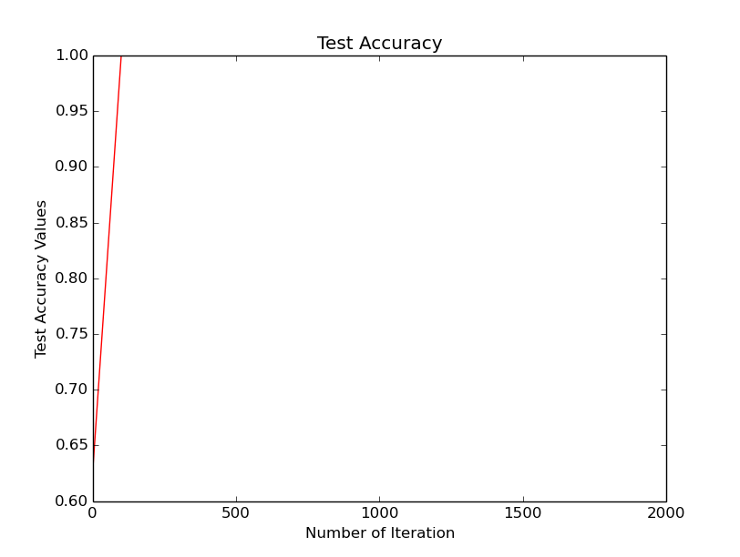

# Caffe and Python 
* Lab 2 Report
* Tuan Nguyen
* Deep Learning - Spring 2017
* Advisor: Dr. Martin Hagan

## Python Basics
1. What is an ”immutable” object? Give some examples.

  Objects whose value is unchangeable once they are created are called immutable. Example:

  ```python
  >>> str = "Deep Learning"
  >>> str
  'Deep Learning'
  >>> str[5]
  'L'
  >>> str[5] = 'l'
  Traceback (most recent call last):
    File "<stdin>", line 1, in <module>
  TypeError: 'str' object does not support item assignment
  ```

2. What is a ”module” in Python?

  A module is a file containing Python definitions and statements. The file name is the module name with the suffix .py appended

3. What is a method?

  In Python, a method is a function that “belongs to” an object (class instance objects and other objects such as list). In other languages such as Java, C++, a method is a member function of a class instance object.

4. What is a class?

  A class is a structure in Object-Oriented Programming that wrap both variables (attributes) and functions (behaviors). 

5. Explain how indentation is used in Python

  Python uses indentation to structure the code. In Java or C/C++, characters {} are used to group statements into code block. In Python, statements that have the same indentation belong to the same block. 

6. Identify differences between the interactive interpreter and Pycharm debugger.
 * Debugger uses pdb package while interpreter doesn't. 
 * Debugger is much more flexible and informative than intepreter (breakpoints, controls, watch,..)

7. How do you execute a Python program from the command line?

 * At bash, run `python 'file.py'`
 * At bash run `python` to go into the intepreter environment, then `execfile('file.py')`
 * At bash, run `ipython` then `run file.py`
  
## Python programm for HW1-Problem3
### Python code

```python
  1 import matplotlib
  2 matplotlib.use('gtk')
  3 import matplotlib.pyplot as plt
  4 import numpy as np
  5 
  6 R = 1
  7 Q = 3
  8 lr = 0.01
  9 
 10 x = np.zeros((2,1))
 11 P = np.array([-1, 0, 1]).reshape(3,1)
 12 T = np.array([-1.5, 0, 2.5]).reshape(3,1)
 13 G = np.array([[-1,0,1], [1,1,1]]).T
 14 
 15 c = np.dot(T.T, T)
 16 d = np.dot(G.T, T) * (-2)
 17 A = np.dot(G.T, G) * 2
 18 
 19 def floss():
 20    F = np.dot(np.dot(x.T, A), x)
 21    F = F + np.dot(d.T, x)
 22    F = F + c
 23    return F
 24 
 25 def df():
 26     delta = np.dot(A, x)
 27     delta = delta + d
 28     return delta
 29 
 30 def update(grad):
 31     global x
 32     x = x - grad * lr
 33 
 34 sse = np.zeros(1000)
 35 
 36 def runtest():
 37     global sse
 38     iter = 0
 39     sse[iter] = floss()
 40     grad = df()
 41     print('iter[{0}]: x={1} floss={2} grad={3}'.format(iter, x, floss(), np.linalg.norm(grad)))
 42     while (np.linalg.norm(grad) >= 0.01) & (iter < 999):
 43         iter = iter + 1
 44         grad = df()
 45         update(grad)
 46         sse[iter] = floss()
 47         print('iter[{0}]: x={1} floss={2} grad={3}'.format(iter, x, floss(), np.linalg.norm(grad)))
 48     plt.plot(sse[0:iter])
 49 runtest()

```
And here is the plot of loss function vs iteration


## Square Diamon Pattern Recognition
### Run the programs
* Append following lines to ~/.bashrc to set up environment variables
  
  ```bash
  #tuan added March 1 for caffe import python
  export PYTHONPATH=$PYTHONPATH:/home/martin/caffe/python
  export CAFFE_ROOT=/home/martin/caffe
  export LD_LIBRARY_PATH=$LD_LIBRARY_PATH:/usr/local/cuda/lib64
  ```
* Install lmdb lib for python
  ```bash
  sudo python -mpip lmdb
  ```
* Add folder testMylmdbTest and copy all from testMylmdb

* Go to iPython interactive intepreter
  ```bash
  martin@martin-XPS-8700:~/Desktop/tuandn/git_repo/deep_learning/lab2$ ipython
  Python 2.7.6 (default, Jun 22 2015, 17:58:13) 
  Type "copyright", "credits" or "license" for more information.

  IPython 2.3.0 -- An enhanced Interactive Python.
  ?         -> Introduction and overview of IPython's features.
  %quickref -> Quick reference.
  help      -> Python's own help system.
  object?   -> Details about 'object', use 'object??' for extra details.

  In [1]: 
  ```
  
* Run `run SquareDiamondLMDB.py`
  
  ```python
  In [2]: run SquareDiamondLMDB.py
  In [3]: who
  N	 X	 caffe	 d1	 d2	 d3	 d4	 d5	 datum	 
  diamond	 env	 file_content	 fo	 i	 lmdb	 map_size	 my_root np	 
  os	 s1	 s2	 s3	 s4	 s5	 square	 str_id	 txn	 
  y	
  ```
  
* Run `run SquareDiamon.py` and `run SquareDiamon_Batch.py`
  ```python
  In [4]: run SquareDiamond.py
  ```
  |
:-------------------------:|:-------------------------:
 | 
  |   
  
### Modify Learning Rate and Momentum
Keep Momentum = 0.9 and modify the Learning Rate in `Square_diamond_solver.prototext`
  * Learning Rate = 0.3

    ```
    IPython CPU timings (estimated):
    User   :       4.26 s.
    System :       0.82 s.
    Wall time:      80.72 s.
    ```

  * Learning Rate = 0.1

    ```
    IPython CPU timings (estimated):
    User   :       3.57 s.
    System :       0.37 s.
    Wall time:      18.67 s.
    ```
  * Learning Rate = 0.005

    ```
    IPython CPU timings (estimated):
    User   :       3.42 s.
    System :       0.32 s.
    Wall time:      16.74 s.
    ```
 As it shows, the Learning Rate = 0.005 is the best among 3 tested ones. Now fixing the Learning Rate = 0.005, the script was ran with 3 momentum as following:
 
  * Momentum = 0.5
  
  ```
  IPython CPU timings (estimated):
  User   :       3.18 s.
  System :       0.34 s.
  Wall time:      13.75 s.
  ```
  * Momentum = 1.5
  
  ```
  /usr/local/lib/python2.7/dist-packages/numpy/ma/core.py:4144: UserWarning: Warning: converting a masked element to nan.
  warnings.warn("Warning: converting a masked element to nan.")
  ```
  
  * Momentum = 0.005
  
  ```
  IPython CPU timings (estimated):
  User   :       3.41 s.
  System :       0.33 s.
  Wall time:      17.55 s.
  ```
As shown, Momentum = 0.9 is the best in System time while Momentum = 0.5 is the best in User code time.

## Adding two more layers
  
  

  
