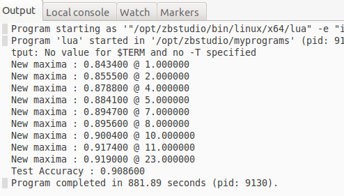
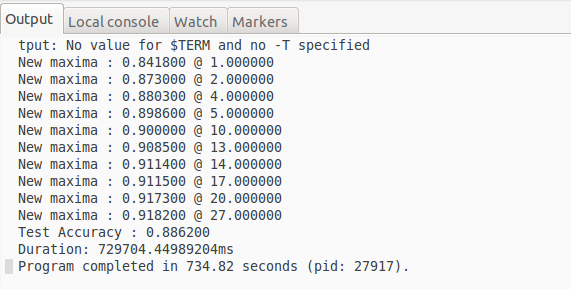

# Mini Project 1: MNIST data training using Neural Network
 - Tuan Nguyen
 - Deep Learning - Spring 2017
 - Advisor: Dr. Martin Hagan
 - Link: https://github.com/danhtuan/deep_learning/
 
## 1. Run the program on CPU
Here is the screenshot of the Output:



__NOTE__
- It took **881.89 seconds** to finish
- The accuracy on test set is lower than on validation set, which is reasonable because test set is *NOT* used to train

## 2. Modify the code to run on GPU
To make it run on GPU, following code added to the original code:
```lua
require 'cunn'
module:cuda()
criterion:cuda()
trainInputs:cuda()
trainTargets:cuda()
validInputs:cuda()
validTargets:cuda()
testInputs:cuda()
testTargets:cuda()
```

__NOTE__ When running the new code, following error message can appear:

>cannot convert 'struct THLongTensor *' to 'struct THCudaLongTensor *'

The reason for this is due to **nn, cunn, torch, cutorch** are out-of-date. The bug has been found and fixed in the new update. Please update using `luarocks` as following:

```
luarocks install torch
luarocks install nn
luarocks install cutorch
luarocks install cunn
```

After fixing, here is the screenshot of the output:



__NOTE__ 
* It took **734.82 seconds** to finish, *which is a little bit faster than CPU version*

## 3. Mini-batches vs Stochastic Gradient Descent
Basically, we have 3 ways to feed data to NN:
* **Batch Gradient Descent (BGD)** : feed all data points in each iteration
* **Mini-batches Gradient Descent (MBGD)** : feed 1 < b < ALL data points in each iteration
* **Stochastic Gradient Descent (SGD)** : feed only 1 data point in each iteration

The original program is set up to perform SGD. In this section, we experiment the NN using MBGD.
* Using package 'optim'
* Divide the dataset into mini-batches to feed to NN
* Vary batch-size

Here is the implementation using Minibatches:
```lua
params, gradParams = module:getParameters()
local optimState = {learningRate = 0.1}
local batchSize = 100 -- batch size


function trainEpoch(module, criterion, inputs, targets)        
    local numBatch = inputs:size(1)/batchSize -- number of batches
    print(inputs[1]:size(1)..'x'..inputs[1]:size(2)..'x'..inputs[1]:size(3))
    for i = 1, numBatch do
      local idx = math.random(1, numBatch) -- random minibatch
      local batchInputs = torch.DoubleTensor(batchSize, 1, 28, 28)
      local batchLabels = torch.DoubleTensor(batchSize)
      --create mini-batch
      for j = 1, batchSize do
        local ref_idx = (idx - 1)  * batchSize + j
        batchInputs[j] = inputs[ref_idx]
        batchLabels[j] = targets:narrow(1, ref_idx, 1)          
      end
      --train using mini-batch
      function feval(params)
        gradParams:zero()

        local outputs = module:forward(batchInputs)
        local loss = criterion:forward(outputs, batchLabels)
        local dloss_doutputs = criterion:backward(outputs, batchLabels)
        module:backward(batchInputs, dloss_doutputs)
        return loss, gradParams
      end
      optim.sgd(feval, params, optimState)
    end
end

```
Here is the output:

```
Program starting as '"/opt/zbstudio/bin/linux/x64/lua" -e "io.stdout:setvbuf('no')" "/home/martin/Desktop/tuandn/deep_learning/prj1/train_mnist_minibatch.lua"'.
Program 'lua' started in '/opt/zbstudio/myprograms' (pid: 29171).
tput: No value for $TERM and no -T specified
1x28x28
New maxima : 0.902500 @ 1.000000
Test Accuracy : 0.910500 
Duration: 78874.533891678ms
Program completed in 83.10 seconds (pid: 29171).
```
__NOTE__
* Mini-batches Gradient Descent converges faster than Stochastic Gradient Descent
* Have the mistmatch size problem (took me hours), temporarily fixed by setting number of epoch = 1. 

## 4. Number of layers vs. Number of Neurons

## 5. Gradient vs. Alternative functions

## 6. Conclusion
* Learned how to run the program on CPU and GPU, can compare the performance
* Learned the difference between SGD vs. Mini-batches
* Learned and compared number of layers vs number of neurons and saw __deep__ >> __wide__ (in this case)
* Learned another function besides of gradient descent
