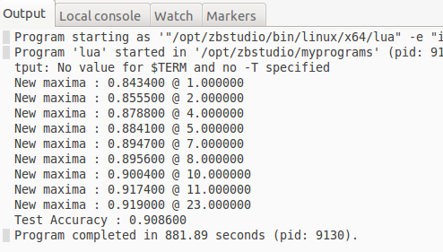

# Mini Project 1: MNIST data training using Neural Network
 - Tuan Nguyen
 - Deep Learning - Spring 2017
 - Advisor: Dr. Martin Hagan
 - Link: https://github.com/danhtuan/deep_learning/

## Abstract

The [MNIST dataset](http://yann.lecun.com/exdb/mnist/) provides a training set of 60,000 handwritten digits and a test set of 10,000 handwritten digits. The images have a size of 28×28 pixels. We want to train a Neural Network to recognize handwritten digits.

## 1. Run the program on CPU
Here is the screenshot of the Output:



__NOTE__
- It took **881.89 seconds** to finish
- The accuracy on test set is lower than on validation set, which is reasonable because test set is *NOT* used to train

## 2. Modify the code to run on GPU
To make it run on GPU, following code added to the original code:
```lua
require 'cunn'
module:cuda()
criterion:cuda()
trainInputs = trainInputs:cuda()
trainTargets = trainTargets:cuda()
validInputs = validInputs:cuda()
validTargets = validTargets:cuda()
testInputs = testInputs:cuda()
testTargets = testTargets:cuda()
```

__NOTE__ When running the new code, following error message can appear:

>cannot convert 'struct THLongTensor *' to 'struct THCudaLongTensor *'

The reason for this is due to **nn, cunn, torch, cutorch** are out-of-date. The bug has been found and fixed in the new update. Please update using `luarocks` as following:

```
luarocks install torch
luarocks install nn
luarocks install cutorch
luarocks install cunn
```

After fixing, here is the screenshot of the output:


__NOTE__
* It took **734.82 seconds** to finish, *which is a little bit faster than CPU version*

## 3. Mini-batches vs Stochastic Gradient Descent
Basically, we have 3 ways to feed data to NN:
* **Batch Gradient Descent (BGD)** : feed all data points in each iteration
* **Mini-batches Gradient Descent (MBGD)** : feed 1 < b < ALL data points in each iteration
* **Stochastic Gradient Descent (SGD)** : feed only 1 data point in each iteration

The original program is set up to perform SGD. In this section, we experiment the NN using MBGD.
* Using package 'optim'
* Divide the dataset into mini-batches to feed to NN
* Vary batch-size

Here is the implementation using Minibatches:

```lua
params, gradParams = module:getParameters()
opt = {
        batchSize = 100,
        learningrate = 0.1,
        momentum = 0.9,
        model = 'mlp2',
        optimization = 'SGD',
        maxIter = 100,
        num_epoch = 10
}

function trainEpoch(module, criterion, inputs, targets)
    for t = 1, inputs:size(1), opt.batchSize do
        --create minibatch
        local inputBatch = torch.Tensor(opt.batchSize, 1, 28, 28)
        local targetBatch = torch.Tensor(opt.batchSize)
        local k = 1
        for i = t, math.min(t + opt.batchSize - 1, inputs:size(1)) do
            --load new sample
            local input = inputs[i]
            local target = targets[i]
            inputBatch[k] = input
            targetBatch[k] = target
            k = k + 1
        end
        --create feval
        local feval = function(params)
          gradParams:zero()
          local outputs = module:forward(inputBatch)
          local loss = criterion:forward(outputs, targetBatch)
          local dloss_doutputs = criterion:backward(outputs, targetBatch)
          module:backward(inputBatch, dloss_doutputs)
          return loss, gradParams
        end

        if opt.optimization == 'LBFGS' then
                lbfgsState = lbfgsState or {
                        maxIter = opt.maxIter,
                        lineSearch = optim.lswolfe
                }
                optim.lbfgs(feval, params, lbfgsState)
                --disp report
                print('LBFGS step')
                print(' - nb of function eval:'..lbfgsState.funcEval)
        elseif opt.optimization == 'SGD' then
                optimState = optimState or {
                        learningRate = opt.learningrate,
                        momentum = opt.momentum,
                        learningRateDecay = 5e-7
                }
                optim.sgd(feval, params, optimState)
        end
    end
end

```
Here is the output:

```
martin@martin-XPS-8700:~/Desktop/tuandn/deep_learning/prj1$ th train_mnist_mb.lua
New maxima : 0.902300 @ 1.000000
New maxima : 0.917900 @ 2.000000
New maxima : 0.924700 @ 3.000000
New maxima : 0.929900 @ 4.000000
New maxima : 0.935700 @ 5.000000
New maxima : 0.938800 @ 6.000000
New maxima : 0.940900 @ 7.000000
New maxima : 0.943100 @ 8.000000
New maxima : 0.944700 @ 9.000000
New maxima : 0.945300 @ 10.000000
Test Accuracy : 0.946400
Duration: 1325930.2461147ms

```
__NOTE__
* Mini-batches Gradient Descent converges a little bit faster than Stochastic Gradient Descent
* The accuracy is improved in comparison with SGD
* Due to the size of training data (50,000), I cannot run the experiment for many batchSize before 5pm, but an update will be available at my [danhtuan/deep_learning](https://github.com/danhtuan/deep_learning)

## 4. Number of layers vs. Number of Neurons

Current code to create a two-layer network:

```lua
-- Create a two-layer network
module = nn.Sequential()
module:add(nn.Convert('bchw', 'bf')) -- collapse 3D to 1D
module:add(nn.Linear(1*28*28, 20))
module:add(nn.Tanh())
module:add(nn.Linear(20, 10))
module:add(nn.LogSoftMax())
```

The number of weights and biases:
* Input Layer:

> 20 * 28 * 28 = 15,680 (weights) and 20 (biases)

* Output Layer:

> 10 * 20 = 200 (weights) and 10 (biases)

I experimented with 3 network configuration as following:
* 1 layers MLP
* 2 layers MLP
* 3 layers MLP

```lua
if opt.model == 'mlp2' then
        --1st layer
        module:add(nn.Linear(1*28*28, 20))
        module:add(nn.Tanh())
        --2nd layer
        module:add(nn.Linear(20, 10))
elseif opt.model == 'mlp3' then
        module:add(nn.Linear(1*28*28, 15))
        module:add(nn.Tanh())
        module:add(nn.Linear(15,10))
        module:add(nn.Tanh())
        --output layer
        module:add(nn.Linear(10,10))
elseif opt.model == 'linear' then
        module:add(nn.Linear(1*28*28, 10))
end

```
Here is the output for 1 layer (linear):

```
martin@martin-XPS-8700:~/Desktop/tuandn/deep_learning/prj1$ th train_mnist_mb.lua
New maxima : 0.889600 @ 1.000000
New maxima : 0.901600 @ 2.000000
Test Accuracy : 0.908400
Duration: 271843.0109024ms

```

__NOTE__
* In comparison with 2 layers, 1 layer is faster and less accurate
* An experiment with 3 layers network will be updated soon on my github repo


## 5. Gradient vs. Alternative functions
The original program using Gradient Descent. In this section, a [LBFGS](https://en.wikipedia.org/wiki/Limited-memory_BFGS) method is used as following:

```
opt = {
        batchSize = 100,
        learningrate = 0.1,
        momentum = 0.9,
        model = 'mlp2',
        optimization = 'SGD',
        maxIter = 100,
        num_epoch = 10
}

if opt.optimization == 'LBFGS' then
        lbfgsState = lbfgsState or {
                maxIter = opt.maxIter,
                lineSearch = optim.lswolfe
        }
        optim.lbfgs(feval, params, lbfgsState)
        --disp report
        print('LBFGS step')
        print(' - nb of function eval:'..lbfgsState.funcEval)
elseif opt.optimization == 'SGD' then

```

## 6. Conclusion
* Learned how to run the program on CPU and GPU, can compare the performance
* Learned the difference between SGD vs. Mini-batches
* Learned to vary number of layers vs number of neurons
* Learned another function besides of gradient descent
