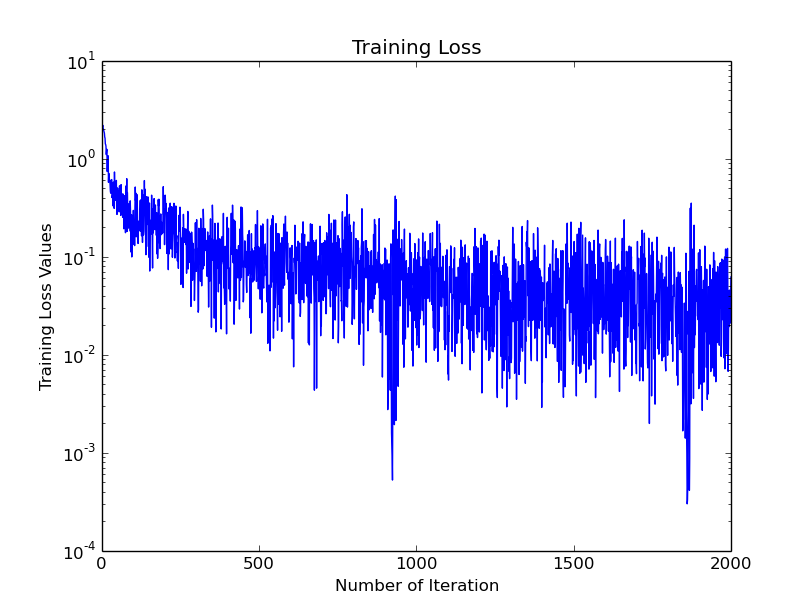
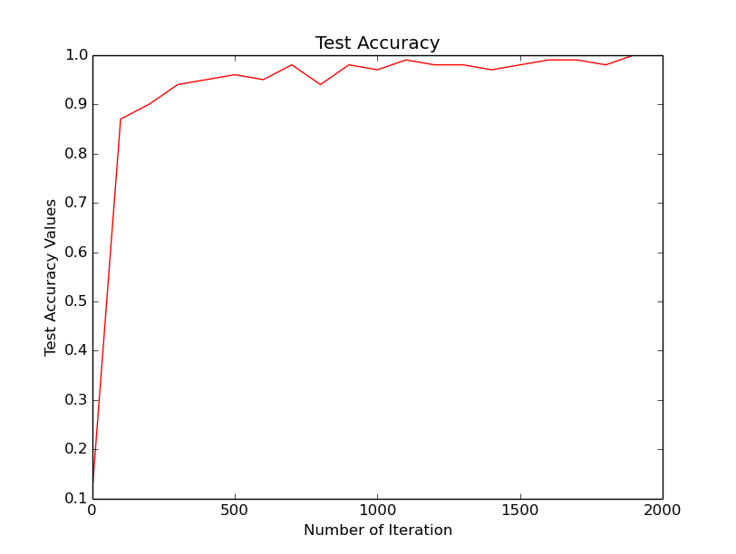
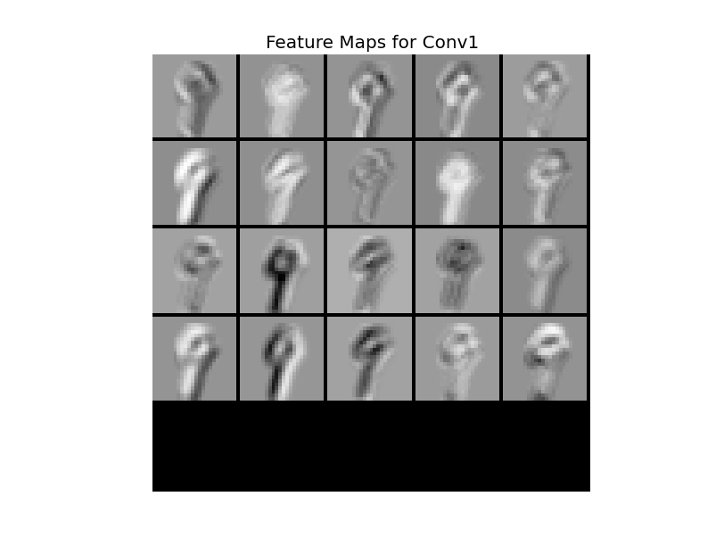
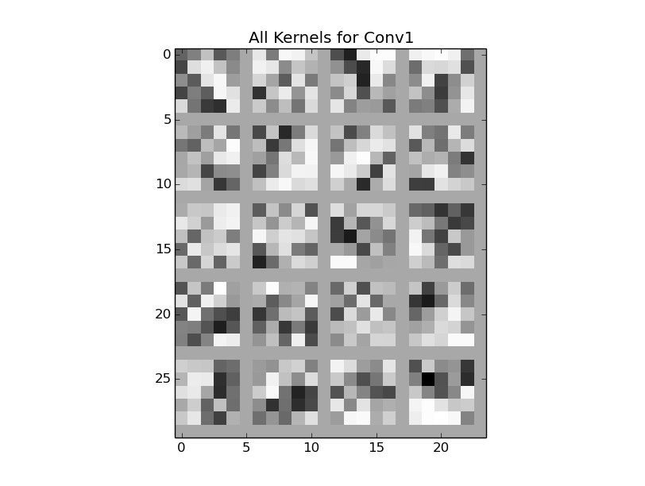
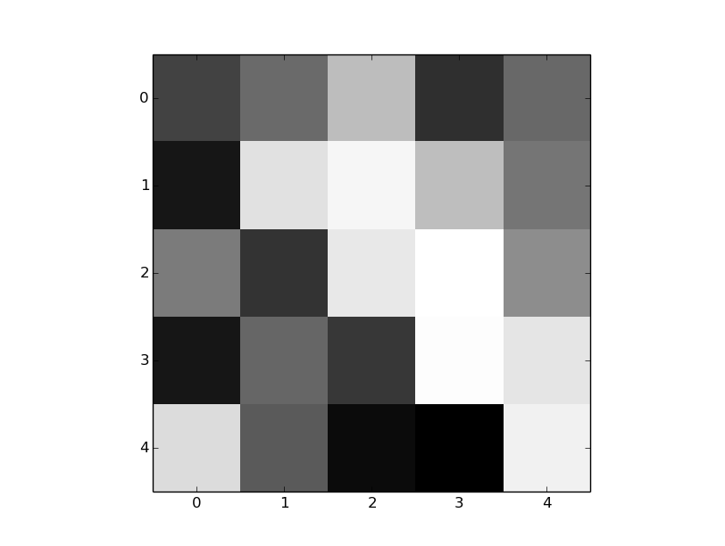
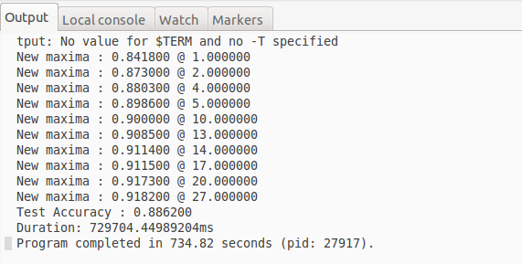
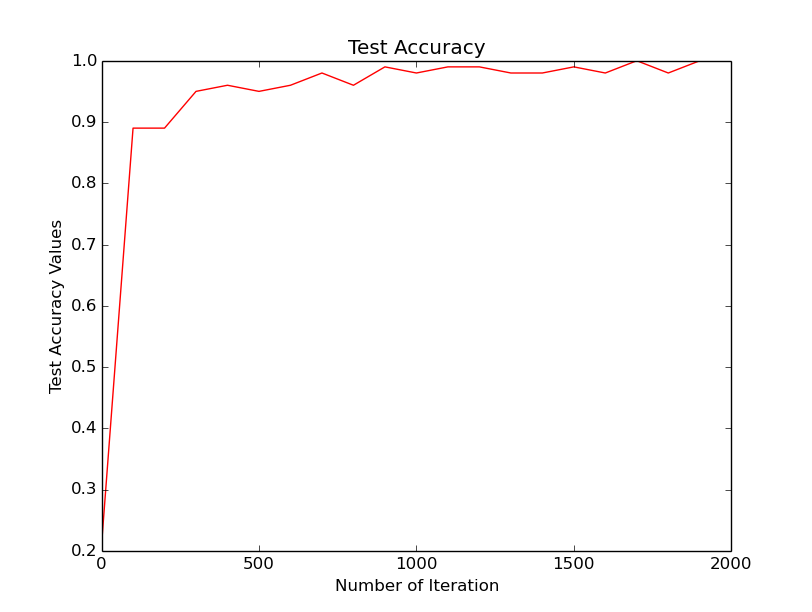
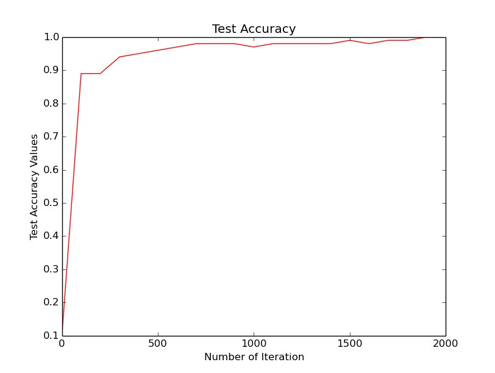

# Miniproject 2: Caffe and MNIST dataset
* Tuan Nguyen
* Spring 17
* Deep learning - Dr. Martin Hagan

## 1. Setting up
* Download 4 data files and unzip
* Modify create_mnist.sh
* Modify prototxt files
* Run `train_mnist.py` file and observe the outputs as following:

|
:---------------------------------:|:---------------------------------:
|
|

## 2. Investigate the kernels

Basically, each kernel is used to explor a specific `feature` in the input data. The provided CVN uses two convolution layers, the first convolution layer has 20 kernels and the second one has 50 kernels. Below is all 20 kernels and one specific kernel respectively for the first layer.

All kernels for Conv1 | One kernel for Conv1
:---------------------------------:|:---------------------------------:
|

Investigating into above kernels, we can see that different kernels try to explor different `features`, or in this case, different `textures/edges` in the images of numerals. The given specific kernel, for example, is helpful for numerals that have the diagonal edges/curve (back slash/curve) such as `6, 8, 9`. 

## 3. Performance Convolution Network (CVN) vs. Multilayer Network (MLP)
### 3.1 Accuracy
Here is the output when runing MLP:



And here is the output when runing CVN:

```
Iteration 1900 testing... accuracy: 0.990000009537
data	(128, 1, 28, 28)
label	(128,)
conv1	(128, 20, 24, 24)
pool1	(128, 20, 12, 12)
conv2	(128, 50, 8, 8)
pool2	(128, 50, 4, 4)
ip1	(128, 500)
ip2	(128, 10)
loss	()
conv1	(20, 1, 5, 5) (20,)
conv2	(50, 20, 5, 5) (50,)
ip1	(500, 800) (500,)
ip2	(10, 500) (10,)

IPython CPU timings (estimated):
  User   :      84.52 s.
  System :      14.62 s.
Wall time:     128.77 s.
```
As shown, the CVN is better in term of accuracy in comparison with MLP. However, it is worth to mention here that I am not sure whether the CVN accuracy is for the TEST set or just TRAINING set (I am doubt that it is TRAINING set). Based on LeCun's website, though:
* Convolutional net LeNet-5, [no distortions]	-- > 0.95 %lost	
* 3-layer NN, 500+150 hidden units	-->	2.95 %lost

So it is reasonable to conclude that CVN is better than MLP in this criteria.

### 3.2 Performance

For CVN timings:

```
IPython CPU timings (estimated):
  User   :      84.52 s.
  System :      14.62 s.
Wall time:     128.77 s.
```

For MLP timings:


Intuitively, CVN is slower than MLP, partly because the convolution is normally slower than matrix multiplication. However, it is shown above that MLP is much slower in total time. It is reasonable because CVN might converge faster than MLP. However, because Miniproject 1 uses Torch and Miniprojet 2 uses Caffe, the comparison is not fair and may be used as reference only.

## 4. Minibatches Size (BS)
### 4.1 Experiment
* BS = 64 (default)

```
IPython CPU timings (estimated):
  User   :      54.06 s.
  System :      10.18 s.
Wall time:     155.99 s.
```
*  BS = 128 (double of default) 

```
IPython CPU timings (estimated):
  User   :      84.52 s.
  System :      14.62 s.
Wall time:     128.77 s.
```

* BS = 32 (half of default)

```
IPython CPU timings (estimated):
  User   :      37.98 s.
  System :       6.54 s.
Wall time:      60.55 s.
```

* BS = 8 (1/8 of default) --> Better speed but Accuracy is not good 

```
IPython CPU timings (estimated):
  User   :      27.39 s.
  System :       4.52 s.
Wall time:      82.52 s.
```

*  BS = 1 (1/64 of default) --> Accuracy is really bad (0.07) and Error observed

```
Iteration 1900 testing... accuracy: 0.070000000298
/usr/local/lib/python2.7/dist-packages/numpy/ma/core.py:4144: UserWarning: Warning: converting a masked element to nan.
  warnings.warn("Warning: converting a masked element to nan.")
```

### 4.2 Comparison
Bigger Batch Size | Smaller Batch Size
:----:|:----:
more accurate | less accurate
slower training | faster training

*Based on observation, BS = 32 is the best in speed given the constraint about Accuracy.*

## 5. Dropout Layer

Dropout layer is claimed a simple way to reduce/prevent overfitting in training NN. Here I added a dropout layer at fully-connected layer (fc or ip) as following:

```
125 layer{
126     name: "dropout1"
127     type: "Dropout"
128     bottom: "ip1"
129     top: "ip1"
130     dropout_param {
131         dropout_ratio: 0.5
132     }
133 }
```

Here is the running time and test accuracy:

```
IPython CPU timings (estimated):
  User   :      52.60 s.
  System :      10.15 s.
Wall time:     131.81 s.
```

Test Accuracy (No Dropout) | Test Accuracy (Dropout)
:---------------------------------:|:---------------------------------:
|

Based on above information, Dropout doesn't change too much running time while making the accuracy line smoother. So it is safe to say it helps improve the testing error. 

## 6. Deep Learning vs. Narrow Wide Learning

