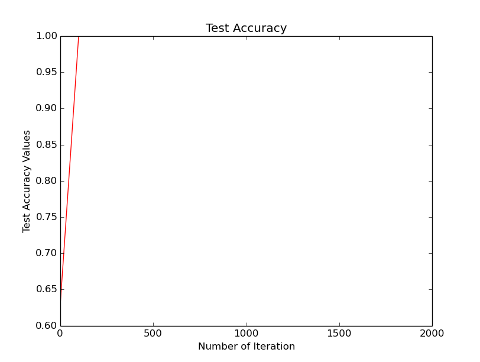

# Miniproject 2: Caffe and MNIST dataset
* Tuan Nguyen
* Spring 17
* Deep learning - Dr. Martin Hagan

## 1. Setting up
* Download 4 data files and unzip
* Modify create_mnist.sh
* Modify prototxt files
* Run `train_mnist.py` file and observe the outputs as following:

|
:---------------------------------:|:---------------------------------:
|
|

## 2. Investigate the kernels

Basically, each kernel is used to explor a specific `feature` in the input data. The provided CVN uses two convolution layers, the first convolution layer has 20 kernels and the second one has 50 kernels. Below is all 20 kernels and one specific kernel respectively for the first layer.

All kernels for Conv1 | One kernel for Conv1
:---------------------------------:|:---------------------------------:
|

Investigating into above kernels, we can see that different kernels try to explor different `features`, or in this case, different `textures/edges` in the images of numerals. The given specific kernel, for example, is helpful for numerals that have the diagonal edges/curve (back slash/curve) such as `6, 8, 9`. 

## 3. Performance CVN vs. Multilayer Networks
### 3.1 Accuracy
* On training set

Convolution Network | Multilayers Network
:---------------------------------:|:---------------------------------:
|

Based on above figures, both CVN and MLP can reach maximum accuracy but MLP is faster in reaching maximum. It is worth to mention that this is on the training set, not the test set. So it is hard to compare which one is better based on this.

* On test set
